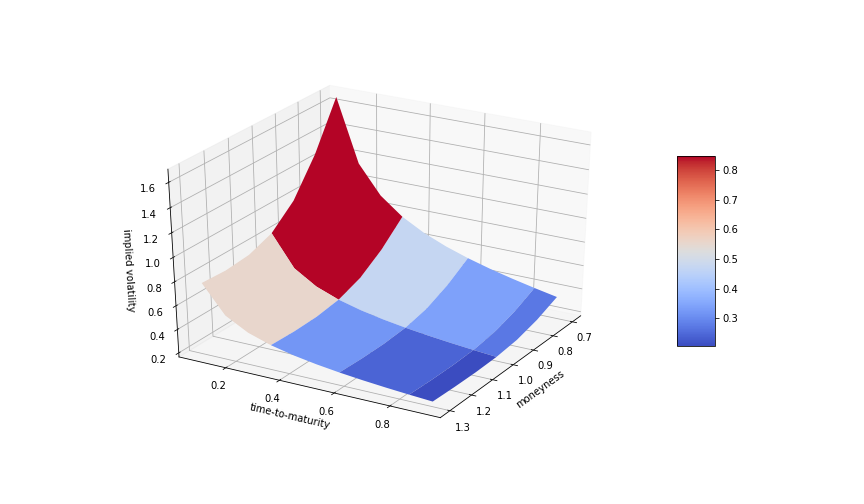
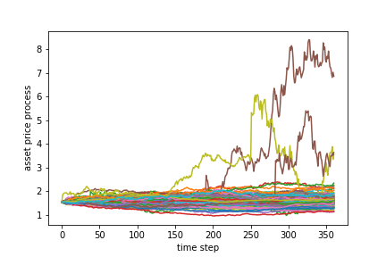
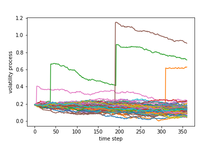

[](http://quantlet.de/)

## [](http://quantlet.de/) **SVCJ_MC** [](http://quantlet.de/)

```yaml

Name of QuantLet : SVCJ_MC

Published in : Hedging under jump induced market incompleteness

Description : 'Simulation of the Euler-discretized Stochastic Volatility with Correlated Jumps model and Monte Carlo Option Pricing'

Keywords : 'Euler discretization, Monte Carlo Option Pricing, SVCJ, Darrel Duffie, Cryptocurrencies'

Author: Jovanka Lili Matic 

Submitted : Sunday, 18 August 2019

Output:   'SVCJ Path simulation and MC Option pricing'


```







### [IPYNB Code: SVCJ_MC.ipynb](SVCJ_MC.ipynb)


automatically created on 2019-12-16